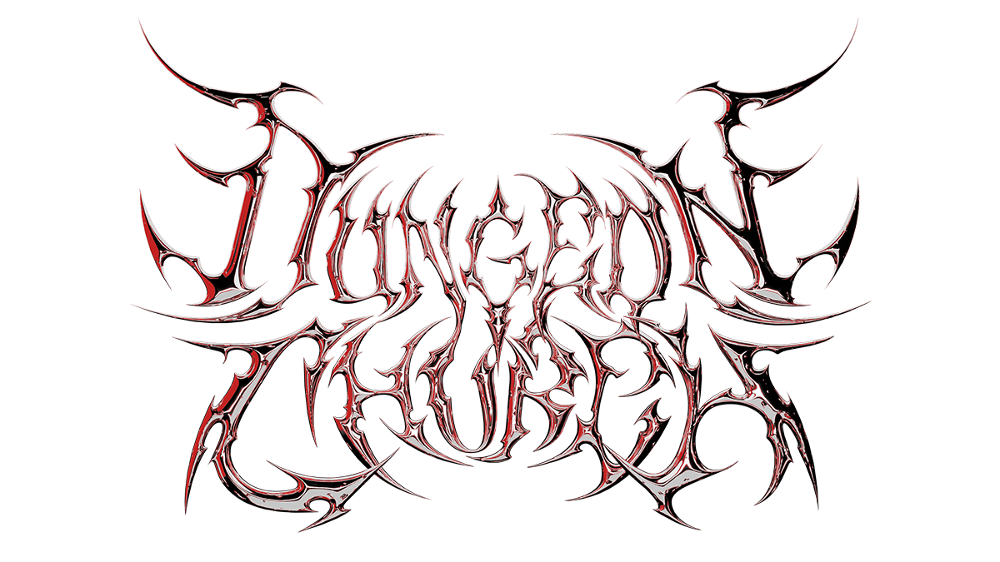

<p align="center">
    <br>
    <a href=https://github.com/oakbrad/dungeonchurch>
        
    </a>
    <a href=https://github.com/oakbrad/dungeonchurch-pyora>
        
    </a>
    <a href=https://github.com/oakbrad/dungeonchurch-cogs>
        
    </a>
</p>

# Dungeon Church Cogs
[Red-DiscordBot](https://github.com/Cog-Creators/Red-DiscordBot/releases) cogs by the [Dungeon Church](https://www.dungeon.church) RPG group.

Focused on making RPG, D&D, & game related cogs - ideas or pull requests welcome.

## Installation
To add these cogs to your instance, run this command first (`[p]` is your bot prefix):

```
[p]repo add dungeonchurch https://github.com/oakbrad/dungeonchurch-cogs
```

Then install your cog(s) of choice:

```
[p]cog install dungeonchurch <cog_name>
```

Finally, load your cog(s):

```
[p]load <cog_name>
```
## API Keys

For cogs that need API keys, set them globally in Red's shared API storage:

```
[p]set api openai api_key,<paste here>
[p]set api googlesheets api_key,<paste here>
[p]set api ghost key_id,<id> key_secret,<secret>
[p]set api outline api_key,<paste here>
```

## Slash Commands
To register slash commands, first load the cog, then list the commands available. Enable the commands you want to register, then sync them with Discord.

```
[p]slash list
[p]slash enable <command>
[p]slash sync
```

# Cogs
Current cogs and their commands. `[p]` is your bot prefix, `/` slash commands indicate a hybrid command. 

## augury
A simple roller that transforms into a customizable NPC when you add an OpenAI API key.
* `/augury` make an appeal to the gods
* `[p]augur` to change settings

## dice
Forked from [PCXCogs](https://github.com/PhasecoreX/PCXCogs). I added better formatting and commands useful for RPG players, including contested rolls.
* `/roll` roll complicated [dice formulas](https://github.com/StarlitGhost/pyhedrals)
* `/qr <mod> <@mention>` quick roll 1d20, optionally challenge with a mention
* `/adv <mod>` quick roll 2d20dl
* `/dis <mod>` quick roll 2d20dh
* `/randstats` roll ability scores within a set range
* `/flipcoin <@mention>` flip a coin, get heads or tails. Mention to have someone else call it.
* `/eightball` ask the Magic 8 Ball
* `[p]diceset` to change settings

## dragonchess (threes)
The dice game threes, aka dragonchess if you play in [Pyora](https://github.com/oakbrad/dungeonchurch-pyora). Tracks stats per player and a leaderboard.
* `/threes rules` show the rules
* `/threes play <@mention>` start a game with an optional challenge, otherwise it's open to first comer
* `/threes leaderboard` server rankings
* `/threes stats <@mention>` see player stats, defaults to self with no mention
* `[p]dc` settings, reset rankings, set timeout, debug game state

## ghostsync
Tools for linking [Ghost](https://ghost.org) members to Discord accounts, syncing subscription status to a Discord role, and syncing Discord roles to Ghost labels. This allows you to reward Ghost subscribers with Discord roles, or segment your Ghost newsletters by Discord roles. Requires setting a Ghost Integration Admin API key & secret.

> **Privacy Note:** this cog stores the user's numeric Discord ID in the Ghost Member Profile, under the private "Note". This is visible to any Ghost staff that can see the Member list.

**Configuration**
* `[p]ghostsync url` base API URL
* `[p]ghostsync interval` how often to sync in seconds
* `[p]ghostsync logchannel` report API failures to this channel
* `[p]ghostsync settings` view current settings

**Ghost Subscription → Discord Role**
* `[p]ghostsync role` role added/removed based on Ghost paid (or comped) subscription
* `[p]ghostsync rolesync` sync a secondary role (ex: Server Boosters) to the primary role

**Discord Role → Ghost Label**
* `[p]ghostsync label <@role> <label_name>` map a Discord role to a Ghost label
* `[p]ghostsync labelrem <@role>` remove a label mapping
* `[p]ghostsync labels` list all label mappings

**Member Management**
* `[p]ghostsync link <email> <@mention>` link a member email to a Discord user (stores ID in Member Note)
* `[p]ghostsync unlink <email OR @mention>` unlink a user (removes ID from Member Note)
* `[p]ghostsync members` list all linked members
* `[p]ghostsync subscribers` list linked subscribers & their subscripßtion tier name
* `[p]ghostsync orphans` list Discord members not linked to Ghost
* `[p]ghostsync sync` force a syncß

## lore
Search and use an [Outline](https://getoutline.com) wiki in the chat.

* `/lore wiki <query>` searches and returns the first article's content
* `/lore search <query>` returns the first 5 search results with buttons to load those articles
* `/lore link <query>` searches and returns just a link (and with optional AI key, a one sentence summary)
* `[p]loreconfig` set base URL & prompts

## q3stat
Quake III Arena [server](https://quake.dungeon.church) notifications with [qstat](https://github.com/Unity-Technologies/qstat). Run qstat via crontab on your server to output JSON to a publicly accessible file:
```
qstat -json -P -q3s dungeon.church:27960 > /var/www/html/qstat.json
```
* `[p]q3stat` to set the URL of that file & notification options.
## randomstatus
Make a list of status activities, then cycle through them randomly or sequentially at a set interval.
* `/randomstatus` to change settings

## rollfood
Rolls a random restaurant from a Google Sheet and provides a link to order. The sheet should have two columns: the restaurant name, and the URL for ordering. Requires [Google Sheets API](https://console.cloud.google.com/flows/enableapi?apiid=sheets.googleapis.com) key.
* `/rollfood` rolls for food
* `/addfood` links to the spreadsheet
* `[p]foodconfig sheet` to set the Sheet ID
* `[p]foodconfig prompt` set an optional prompt for your bot

# Local Development
To work on cogs locally, run the bot in a container:
```yaml
services:
  redbotdev:
    container_name: redbotdev
    image: phasecorex/red-discordbot
    restart: unless-stopped
    volumes:
      - /tmp/redbotdev:/data
      - /path/to/local/dungeonchurch-cogs:/devcogs
    environment:
      - TOKEN=
      - PREFIX=!
      - TZ=America/Los_Angeles
      - PUID=1000
      - OWNER=
```
Add the path and downloader. Locally installed cogs need their dependencies installed manually.
```
[p]addpath /devcogs
[p]load downloader
[p]pipinstall <dependency>
```
